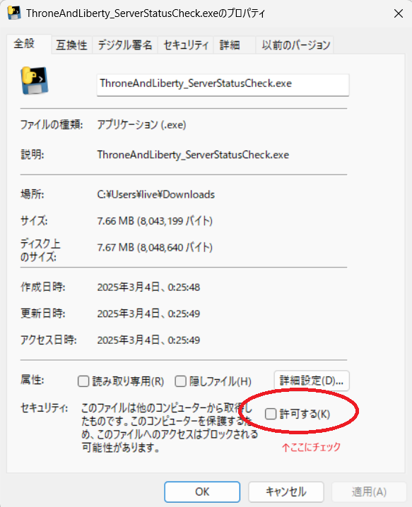

# ThroneAndLiberty_ServerStatusCheck
# 概要
- THTONE AND LIVERTYのALEXIAサーバーのステータスをチェックするアプリケーションです。

## 下記のWEBサイトをチェックしています。
https://www.playthroneandliberty.com/ja-jp/support/server-status

# 動作内容
- 実行するとWindowsコンソールが立ち上がり20秒に一回サイトをチェックします。
- メンテナンス状態でない場合は、BEEP音3回鳴らしてMsgBox表示して終了します。

# 実行方法
Windowsで実行できます 
Releasesから最新のexeをダウンロードしてください。 
https://github.com/omoci-ozouni/ThroneAndLiberty_ServerStatusCheck/releases/tag/Prod

セキュリティのアラートが出ると思いますので、事前にexeファイルを右クリックしてプロパティを開いて一番したにあるセキュリティ欄のチェックを付けてから実行してください。

Python実行環境があれば 
`ThroneAndLiberty_ServerStatusCheck.py` 
を実行でも大丈夫です。 

# exe作成方法備忘
1. pyinstallerをインストール
~~~ windows shell
pip install pyinstaller
~~~ 

2. コマンドプロンプトで作業フォルダに移動し下記を実行
~~~ windows shell
pyinstaller ThroneAndLiberty_ServerStatusCheck.py --onefile
~~~